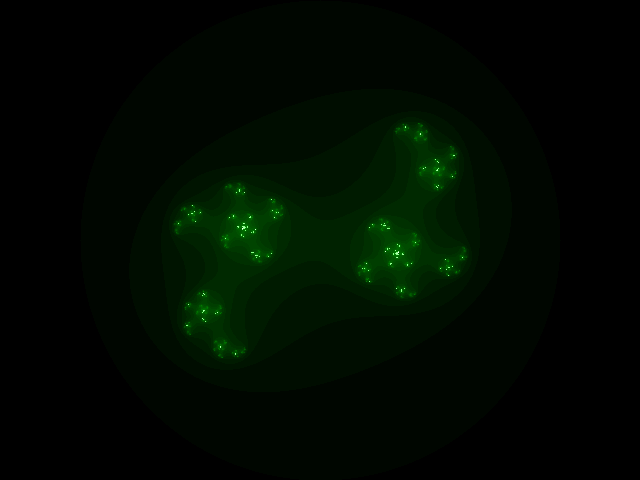

# Interactive Fractal Explorer

## Features
- Browser Canvas + CLI rendering
- Implemented in Rust Yew

## Hosted
- Vercel: https://fractals.jamesmcguigan.com/
- ICP:    https://nwb7c-dqaaa-aaaak-qatfa-cai.ic0.app/

## Documentation
- [BUILD.md](BUILD.md) - rustup + cargo build + CLI
- [DEPLOY.md](DEPLOY.md) - Vercel + ICP hosting config
- [CARGO_PROFILING.md](CARGO_PROFILING.md) - Notes on optimizing cargo build
- [LINKS.md](LINKS.md) - Rust Cargo library ecosystem

## CLI

```
./fractals_cli/target/release/julia_image -c 0.5+0.5i -r 1 -o fractal.png
```